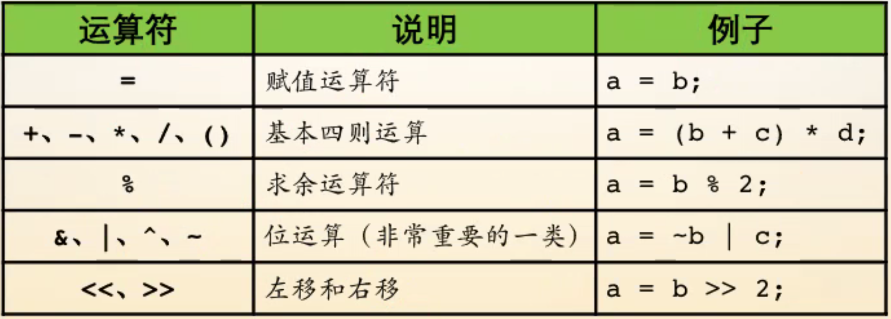
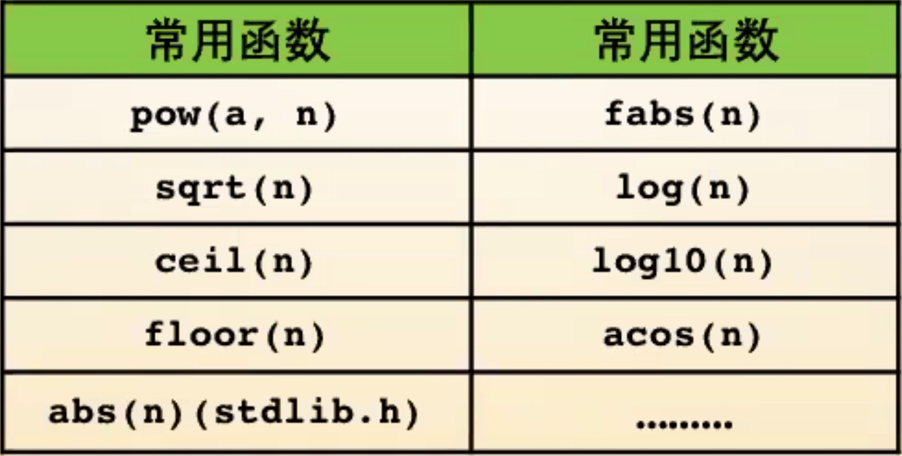
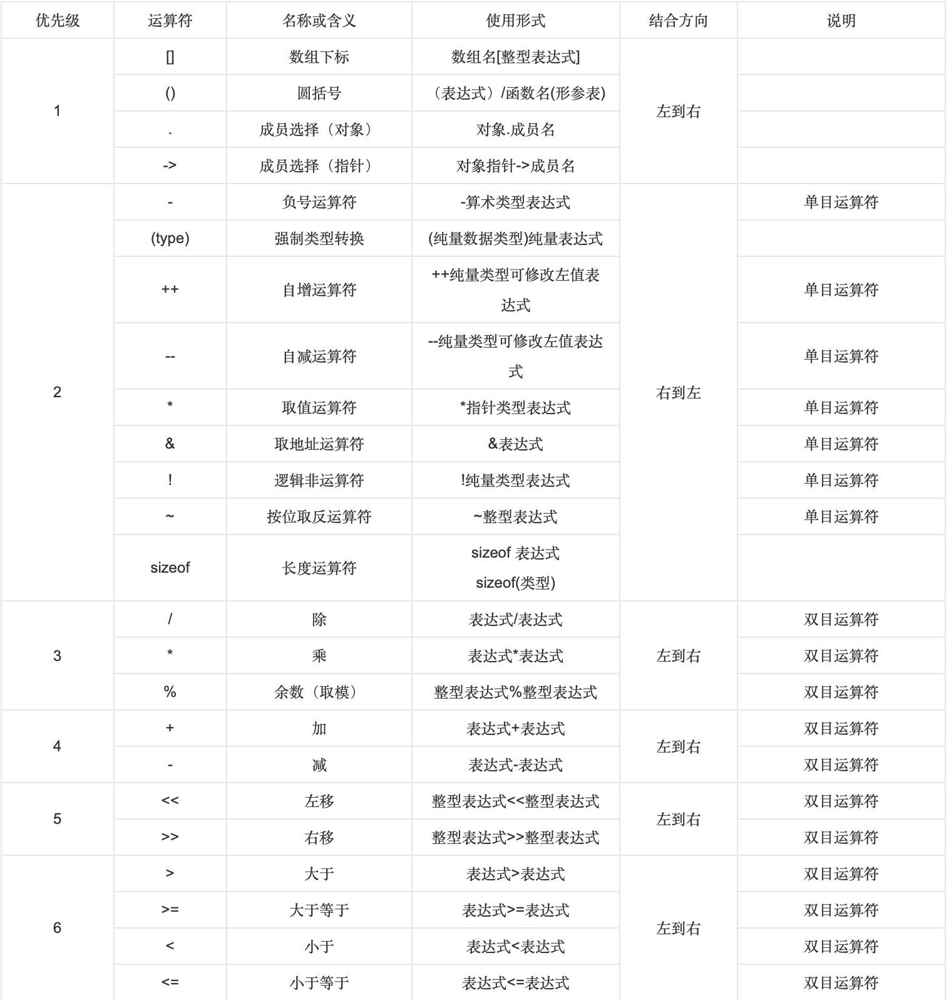
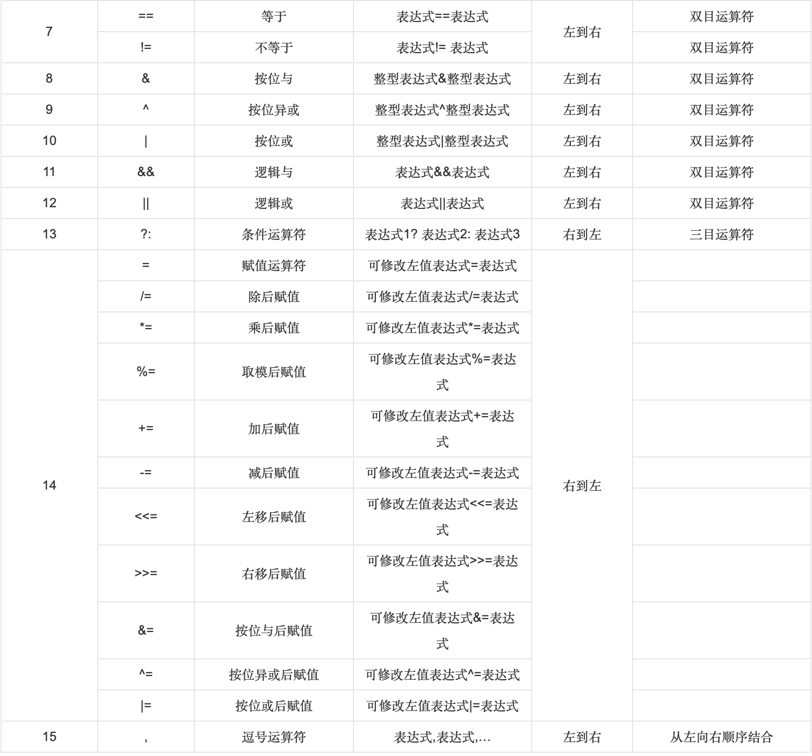

# 2019-12-01 C语言02 - 数学运算

## 运算符

异或（^）为可逆运算

> Tips:
>
> n & 1  结果为1为奇数 0为偶数
>
> 交换t与k的值： t ^= k; k ^= t; t ^= k;

## 数学函数

头文件：`math.h`

- `pow(a, n)` 求a的n次幂，其返回值类型为double
- `sqrt(n)` 求n的平方根，返回值类型为double
- `ceil(n)` 上取整（天花板函数），参数、返回值类型为double
- `floor(n)` 下取整（地板函数），同上
- `abs(n)` 求n的绝对值，其返回值类型为int，参数只能接收整型，定义在头文件stdlib.h中
- `fabs(n)` 求浮点数n的绝对值，参数可接收double型，返回值类型为double
- `log(n)` 求n以e为底的对数
- `log10(n)` 求n以10为底的对数
- `acos(n)` 求arccos(n)的值，参数为弧度数，弧度数为角度*pi / 180（`acos(-1)` = pi）

[极客学院Wiki C&C++ 中文手册](http://wiki.jikexueyuan.com/project/c/)

## 左值与右值

左值：确确实实存在的、定义的

右值：中间变量

## 运算符优先级与结合方向

